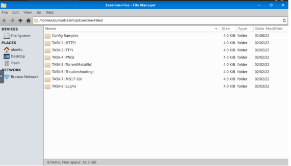
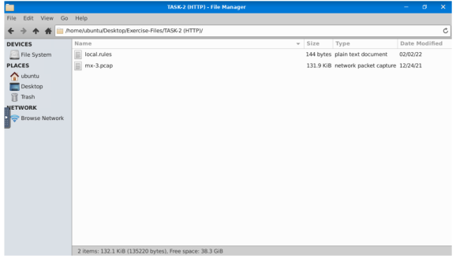
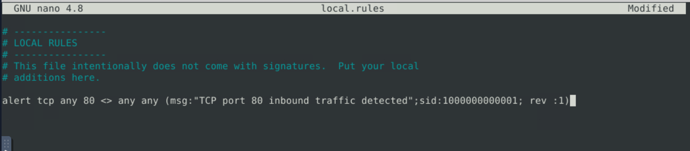
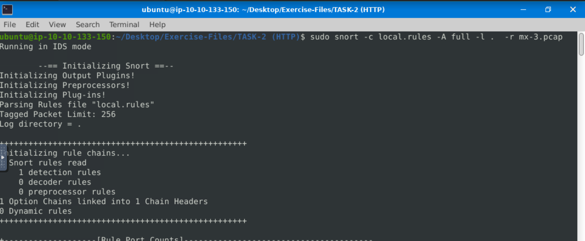

# Write Up Snort Challenge- The Basics TryHackMe
 ## Índice
   - [Preámbulo](#preámbulo)
   - [Escenario](#escenario)
   - [Reto 1 - Analizando Trafico HTTP](#reto-1---analizando-trafico-http)
     - [Pregunta 1 Reto 1](#pregunta-1-reto-1)
     - Pregunta 2 Reto 1
     - Pregunta 3 Reto 1
     - Pregunta 4 Reto 1
     - Pregunta 5 Reto 1
     - Pregunta 6 Reto 1 
     - Pregunta 7 Reto 1 
     - Conclusión Primer reto
## Preámbulo
El análisis de tráfico de red en tiempo real es una habilidad esencial en ciberseguridad.
Snort, como sistema de detección de intrusos (IDS), permite monitorear, registrar y
analizar paquetes de red utilizando reglas personalizadas.
Este documento técnico tiene los siguientes objetivos:
 * Aprender los fundamentos del funcionamiento básico de Snort.
 * Comprender el proceso de captura de tráfico de red.
 * Aprender y practicar el uso de reglas de Snort para analizar   tráfico en tiempo
 real.
## Escenario
El escenario que TryHackMe nos presenta consiste en una máquina basada en Linux y
varios archivos que contienen comunicaciones de diferentes protocolos de red.
Mediante la creación y aplicación de reglas, y utilizando Snort como sistema de
detección y análisis, podremos inspeccionar y analizar ese tráfico en tiempo real para
identificar eventos relevantes y entender el comportamiento de la red.

## Reto 1 - Analizando Trafico HTTP
En este primer reto se nos presentan dos archivos: un archivo .pcap, que contiene los
datos capturados del tráfico de red, y un archivo de reglas locales (“local.rules”), en el
cual escribiremos las reglas necesarias para analizar dicho tráfico utilizando Snort

La primera tarea del reto consiste en escribir una regla que permita detectar todo el tráfico TCP que se origine desde o se dirija hacia el puerto 80.

Una vez escrita, usaremos el archivo para detectar el tráfico dentro del archivo “.pcap”, con el uso del siguiente comando

Ejecutamos `sudo snort -c local.rules -A full -l . -r mx-3.pcap` para analizar el archivo pcap.

Este comando ejecuta Snort utilizando las reglas definidas en el archivo local.rules (-c),
en modo de alerta detallada (-A full), guardando la salida en el directorio actual (-l .) y analizando el archivo de captura mx-3.pcap (-r). 

Gracias a esto, podremos responder las siguientes preguntas que el reto nos presenta. 

Una vez ejecutado el comando, se mostrará un resumen del tráfico recogido, como se observa en la siguiente imagen:

Después de la ejecución, se generará un archivo de logs, el cual tendremos que analizar, ya que contendrá la información relevante para continuar con el reto.

### Pregunta 1 Reto 1