# Write Up Snort Challenge- The Basics TryHackMe
 ## Índice
   - [Preámbulo](#preámbulo)
   - [Escenario](#escenario)
   - [Reto 1 - Analizando Tráfico HTTP](#reto-1---analizando-tráfico-http)
     - [Pregunta 1 Reto 1](#pregunta-1-reto-1)
     - [Pregunta 2 Reto 1](#pregunta-2-reto-1)
     - [Pregunta 3 Reto 1](#pregunta-3-reto-1)
     - [Pregunta 4 Reto 1](#pregunta-4-reto-1)
     - [Pregunta 5 Reto 1](#pregunta-5-reto-1) 
     - [Pregunta 6 Reto 1](#pregunta-6-reto-1)
     - [Pregunta 7 Reto 1](#pregunta-7-reto-1)
     - [Conclusión Primer reto](#conclusión-primer-reto)
   - [Reto 2 - Analizando Tráfico FTP](#reto-2---analizando-tráfico-ftp)
     - [Pregunta 1 Reto 2](#pregunta-1-reto-2)
     - [Pregunta 2 Reto 2](#pregunta-2-reto-2)
     - [Pregunta 3 Reto 2](#pregunta-3-reto-2)
     - [Pregunta 4 Reto 2](#pregunta-4-reto-2)
     - [Pregunta 5 Reto 2](#pregunta-5-reto-2)
     - [Pregunta 6 Reto 2](#pregunta-6-reto-2)
     - [Conclusion Segundo Reto ](#conclusión-segundo-reto)
   - [Reto 3 - Analizando PNG](#reto-3---analizando-png)
     - [Pregunta 1 Reto 3](#pregunta-1-reto-3)
     - [Pregunta 2 Reto 3](#pregunta2-reto-3)
     - [Conclusión Reto 3](#conclusion-reto-3)
   - [Reto 4 - Analizando archivos Torrent](#reto-4---analizando-archivos-torrent)
## Preámbulo
El análisis de tráfico de red en tiempo real es una habilidad esencial en ciberseguridad.
Snort, como sistema de detección de intrusos (IDS), permite monitorear, registrar y
analizar paquetes de red utilizando reglas personalizadas.
Este documento técnico tiene los siguientes objetivos:
 * Aprender los fundamentos del funcionamiento básico de Snort.
 * Comprender el proceso de captura de tráfico de red.
 * Aprender y practicar el uso de reglas de Snort para analizar   tráfico en tiempo
 real.
## Escenario
El escenario que TryHackMe nos presenta consiste en una máquina basada en Linux y
varios archivos que contienen comunicaciones de diferentes protocolos de red.
Mediante la creación y aplicación de reglas, y utilizando Snort como sistema de detección y análisis, podremos inspeccionar y analizar ese tráfico en tiempo real para identificar eventos relevantes y entender el comportamiento de la red.

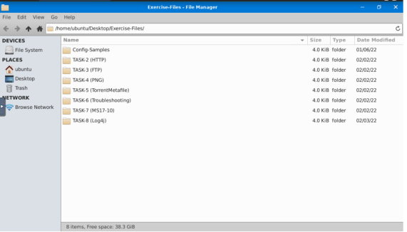
## Reto 1 - Analizando Tráfico HTTP
En este primer reto se nos presentan dos archivos: un archivo .pcap, que contiene los datos capturados del tráfico de red, y un archivo de reglas locales (“local.rules”), en el cual escribiremos las reglas necesarias para analizar dicho tráfico utilizando Snort

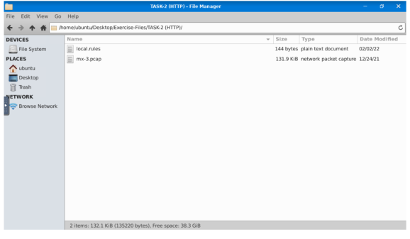

La primera tarea del reto consiste en escribir una regla que permita detectar todo el tráfico TCP que se origine desde o se dirija hacia el puerto 80.

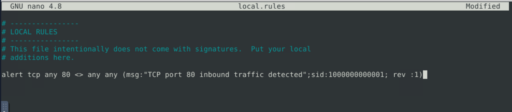

Una vez escrita, usaremos el archivo para detectar el tráfico dentro del archivo “.pcap”, con el uso del siguiente comando

Ejecutamos `sudo snort -c local.rules -A full -l . -r mx-3.pcap` para analizar el archivo pcap.

Este comando ejecuta Snort utilizando las reglas definidas en el archivo local.rules (-c),
en modo de alerta detallada (-A full), guardando la salida en el directorio actual (-l .) y analizando el archivo de captura mx-3.pcap (-r). 

Gracias a esto, podremos responder las siguientes preguntas que el reto nos presenta. 

Una vez ejecutado el comando, se mostrará un resumen del tráfico recogido, como se observa en la siguiente imagen:

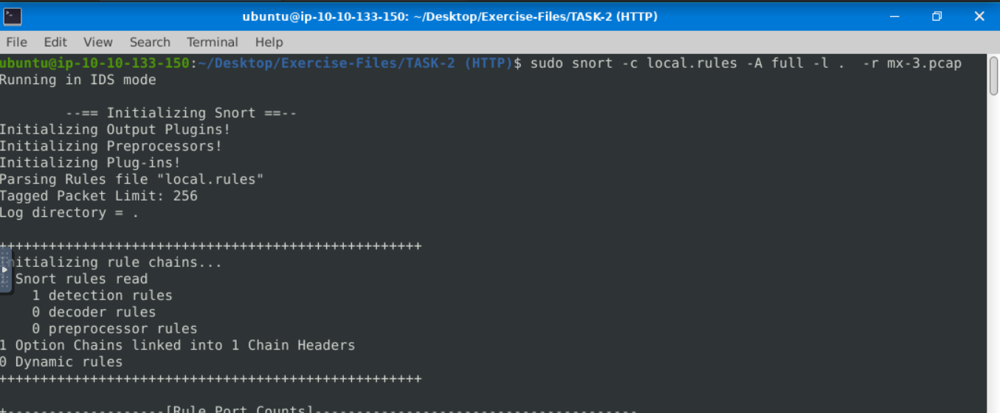

Después de la ejecución, se generará un archivo de logs, el cual tendremos que analizar, ya que contendrá la información relevante para continuar con el reto.

### Pregunta 1 Reto 1
La primera pregunta del reto nos presenta, lo siguiente.

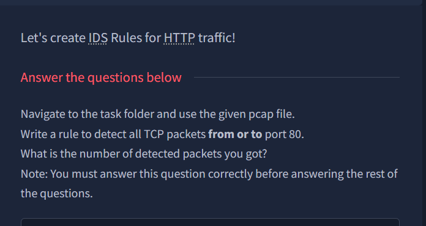

La pregunta nos dice lo siguiente: “¿Cuál es el número de paquetes detectados?”

Con la ejecución del comando anterior `sudo snort -c local.rules -A full -l . -r mx-3.pcap`, obtendremos la respuesta, si  analizamos la información ofrecida por el comando, sabemos que el número de paquetes es 164.

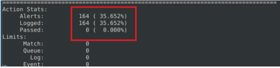

## Pregunta 2 Reto 1
La segunda pregunta del reto es la siguiente

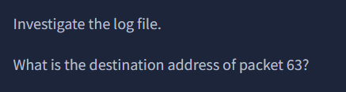

Dicha pregunta, nos pide “¿Cuál es la dirección de destino del paquete 63?.

Con el uso de comandos Snort, analizamos el documento de logs y especificamos que nos muestre lo referente al paquete 63.

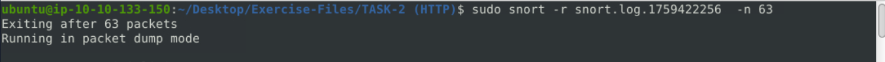

La salida del comando es una seria de información, en este caso del paquete 63

Analizando el contenido nos damos cuenta de que se nos presenta información referente a las conexiones en el puerto: dirección de origen,destino,TTL,etc.

Fijándonos en la IP “216.239.59.99”, nos damos cuenta de que esta es la respuesta correcta.

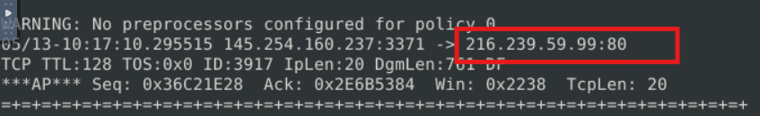
## Pregunta 3 Reto 1

Ahora la pregunta que nos plantea es la siguiente

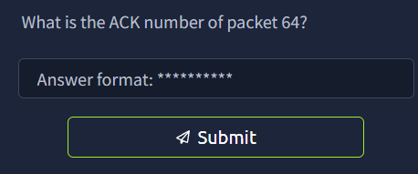
La cual nos pide “¿Cuál es el numero ACK del paquete 64?”
El ACK number (Acknowledgment Number) es el valor que indica al otro extremo que los datos se han recibido correctamente.

Para conocer este número haremos uso nuevamente del archivo de logs obtuvimos en la primera pregunta.

Haremos uso del mismo comando que usamos para ver la información del paquete 63 pero en este caso será del paquete 64

`sudo snort -r snort.log.1759422256 -n 64`

La salida del cual será la información antes vista, en este caso buscaremos el número ACK.

Fijándonos en la información obtenida, sabemos que la respuesta es la siguiente.

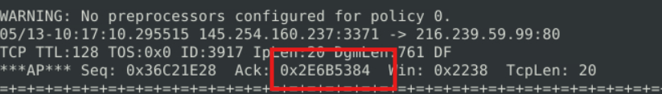

## Pregunta 4 Reto 1
Siguiendo con el reto, nos presenta la siguiente pregunta

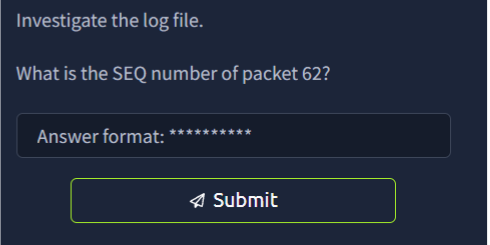

La pregunta reza la siguiente: “¿Cuál es el número SEQ del paquete 65?”

El **SEQ number (Sequence Number)** es un campo de la cabecera que indica el número de secuencia del primer byte de datos que se envía en un segmento. 

Sirve para que el receptor sepa en que orden van los datos y pueda reensamblarlos correctamente. 

Haciendo uso del siguiente comando podremos responder la pregunta 

**sudo Snort -r snort.log.1759422257 -n 62"**

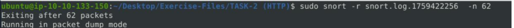

La salida del comando nos nuestra lo siguiente, dejando ver el número SEQ. 

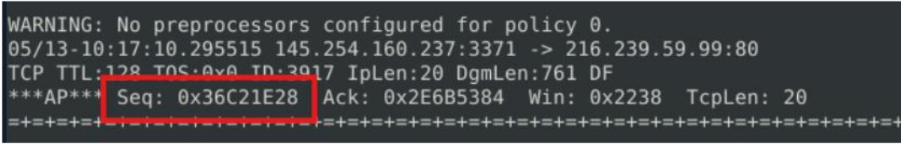

Dejándonos asi la respuesta correcta

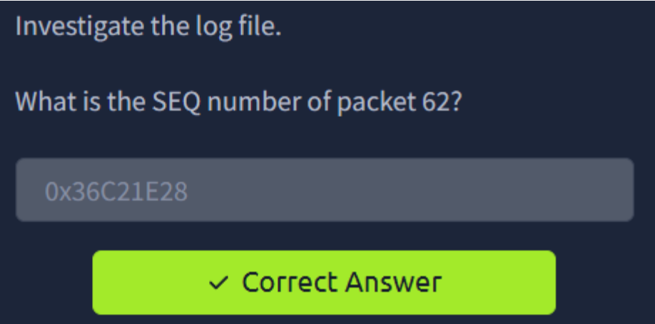

## Pregunta 5 Reto 1

Conituamos con las preguntas y la siguiente es esta

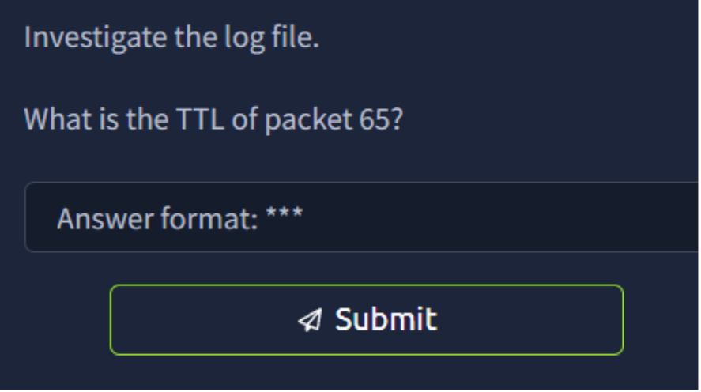

La cual nos pide lo siguiente: "¿Cuál es el TTL  del paquete 65?"

El TTL (Time to Live) es el número de saltos que queda al paquete antes de ser descartado

Analizaremos el archivo de logs con el siguiente comando

**sudo Snort -r snort.log.175942256 -n 65"**

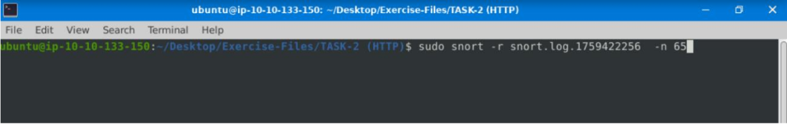

Gracias a dicho comando obtenemos la información requerida

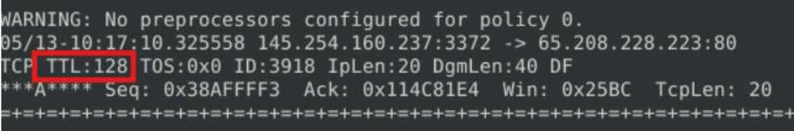

Sabiendo ahora el “TTL”, podemos responder la pregunta que se nos planteaba

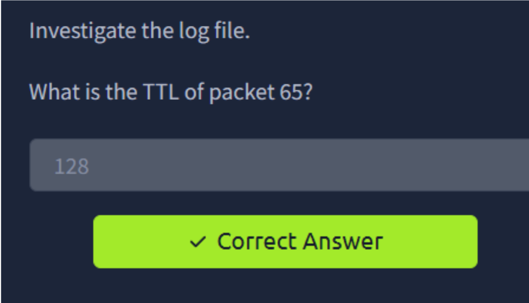

## Pregunta 6 Reto 1 

La penúltima pregunta tambien es referente al paquete 65 y es l siguiente

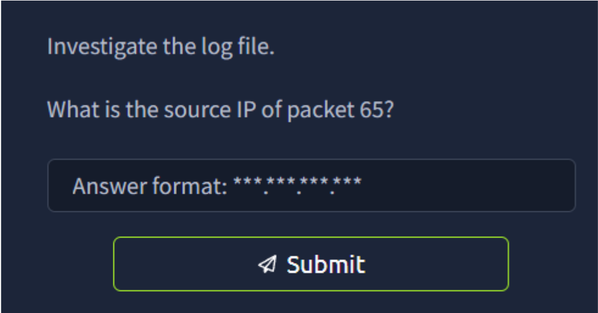

Dicha pregunta nos dice lo siguiente: "¿Cuál es la dirección de origen del paquete 65?"

Analizando el archivo de logs, podremos obtener la respuesta

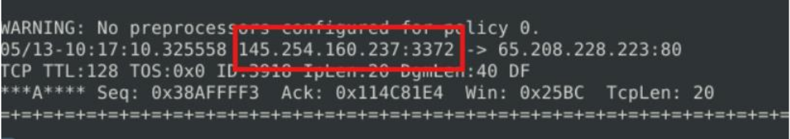

Con la información obtenida deducimos que la dirección es: 145.254.160.237, sabiendo esto, podemos reponder la pregunta 

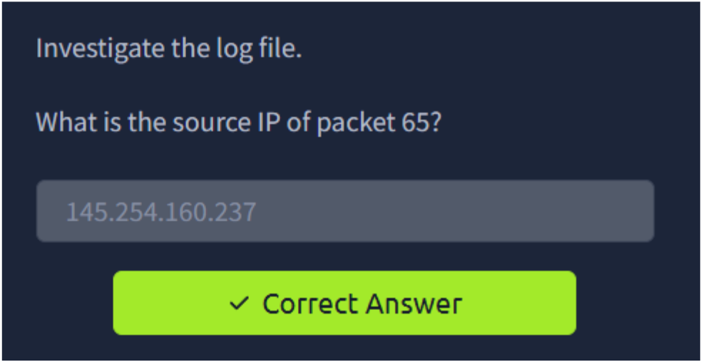

## Pregunta 7 Reto 1

La última pregunta de este primero reto es la siguiente, tambien referente al paquete 65.

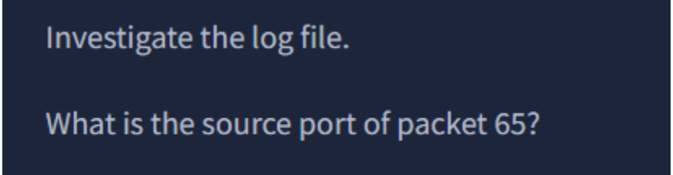

La pregunta nos dice lo siguiente: “¿Cuál es el puerto de origen del paquete 65?”

Analizando el archivo de logs, podremos saber la respuesta de la pregunta

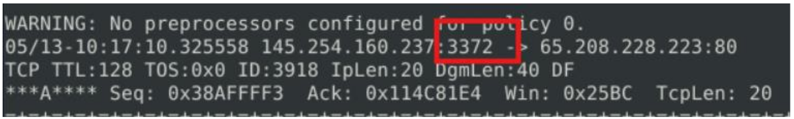

Si nos fijamos despues de la ip de origen le siguiente los dos puesto y seguidamente el
puerto de origen, que en este caso es: 3372

El puerto 3372 está asignado a TIP 2, pero rara vez se utiliza.

Sabiendo esto podemos responder esta última pregunta

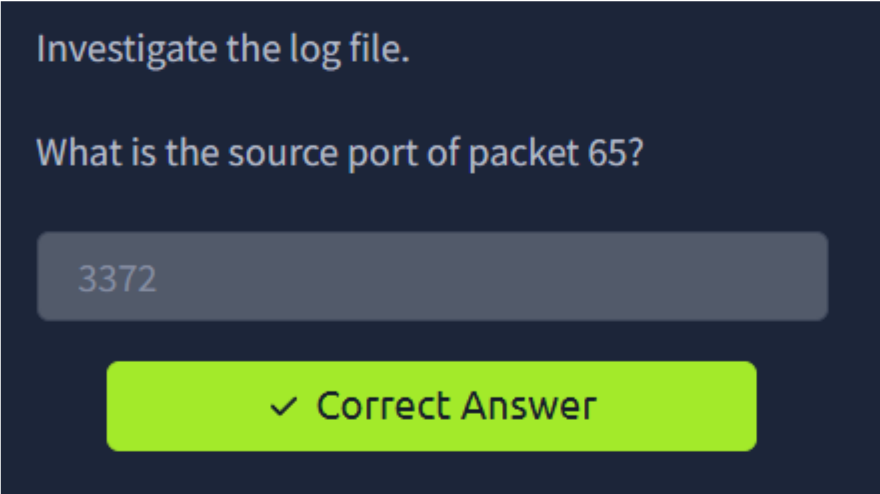

## Conclusión Primer reto
En este primer apartado se ha puesto en práctica el análisis del tráfico HTTP, el uso de
Snort y el análisis de archivo de logs para analizar dicho tráfico.

Permitiendo asi familiarizarse con el uso de esta herramienta.

## Reto 2 - Analizando Tráfico FTP
Esta vez, tendremos tráfico FTP que analizar, al igual, en el primer reto, habrá un archivo .pcap y un archivo local rules.
## Pregunta 1 Reto 2
En este primera pregunta, tenemos la siguiente premisa: “Escribe una simple regla que detecta todo el tráfico TCP por el puerto 21”.

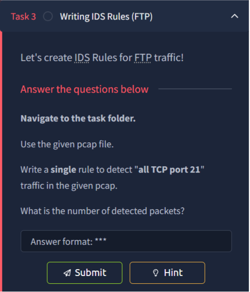

Sabiendo esto, escribiremos la siguiente regla, dicha regla captura todo el tráfico TCP que pasa por el puerto 21

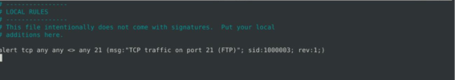

## Pregunta 2 Reto 2
Ahora nos enfrentamos a la siguiente pregunta.
Tendremos que investigar el archivo log generado en la primera pregunta, para responder esta

Nos tendremos que fijar en que servicio de FTP es el estamos investigando.

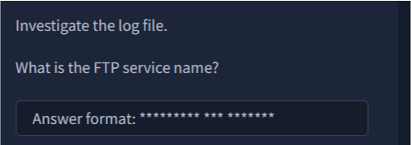

Para que la visualización del archivo sea más ordenada, usaremos el comando “strings”, el cual nos permitirá ver la información del archivo en líneas.

Como observamos, en la primera línea nos aparecerá la respuesta a la pregunta.

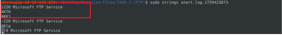

Y podemos certificar que es la respuesta correcta

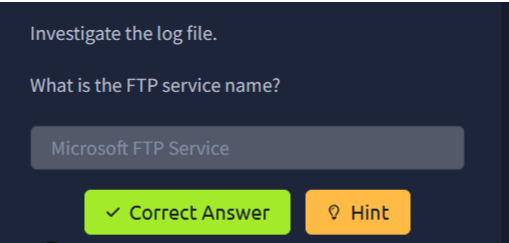

## Pregunta 3 Reto 2
En la siguiente pregunta, se nos pide que fijemos una regla que detecte los intentos fallidos de login dentro del FTP.

*Es bueno que comentes o elimines la regla anterior, para que sea la nueva la se aplique.

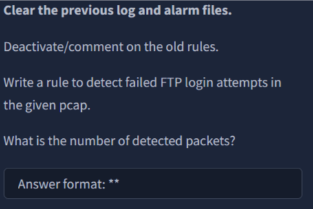

Escribiremos la siguiente reglas, para conseguir el objetivo

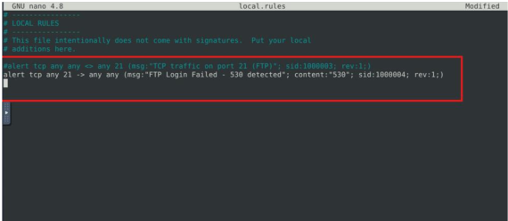

Investigando el archivo .pcap con el siguiente comando:

***“sudo snort -c local.rules -A full -l . -r ftp-png-gif.pcap”*** 

Podremos saber la respuesta y podemos ver que son 41 fallos de login dentro del FTP.

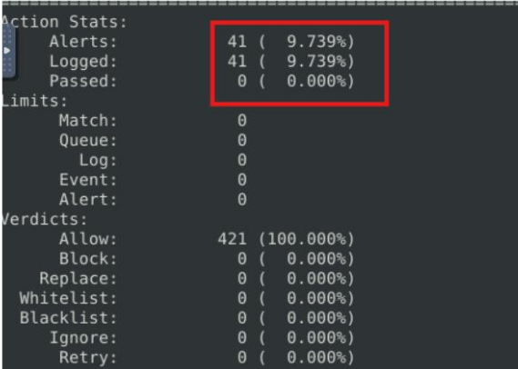

Y asi podemos contestar la pregunta

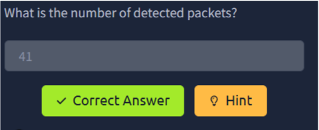

## Pregunta 4 Reto 2
En esta pregunta, tendremos que escribir una regla para captura los logins existosos.

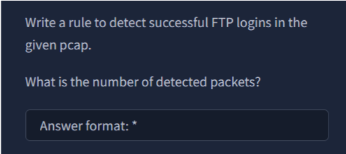

Escribimos la siguiente regla

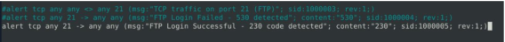

Si con esta regla investigamos el archivo .pcap, podemos ver que son “1” los logins existosos al FTP.

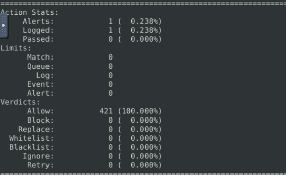

Y podemos comprobar que la respuesta es la correcta

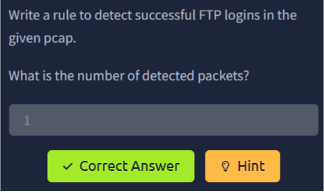

## Pregunta 5 Reto 2
La pregunta que sigue es esta: “Escribe una regla para detectar intentos de inicio de sesión FTP con un nombre de usuario válido pero sin que se haya ingresado la contraseña todavía”.

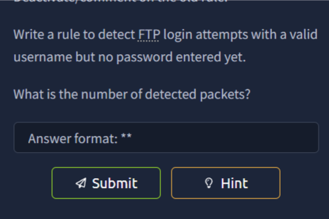

Escribiremos la regla siguiente

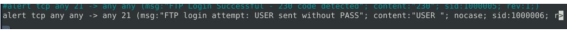

Si investigamos el archivo, podemos ver que son “42” los intentos de login.

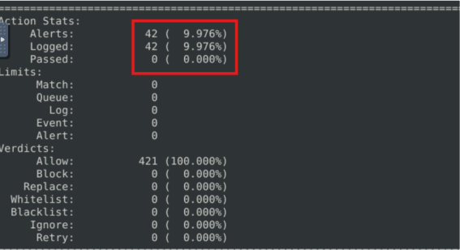

Y la respuesta es correcta

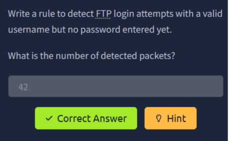

## Pregunta 6 Reto 2 
En esta pregunta se nos pregunta lo siguiente: : “Escribe una regla para detectar intentos de inicio de sesión FTP con el usuario Administrador pero sin que se haya ingresado la contraseña todavía”.

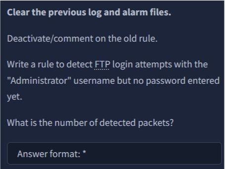

Escribimos la regla y analizamos él .pcap

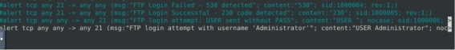

Investigando el archivo podemos ver que son 7 los logins existosos sin contraseña del usuario Administrador.

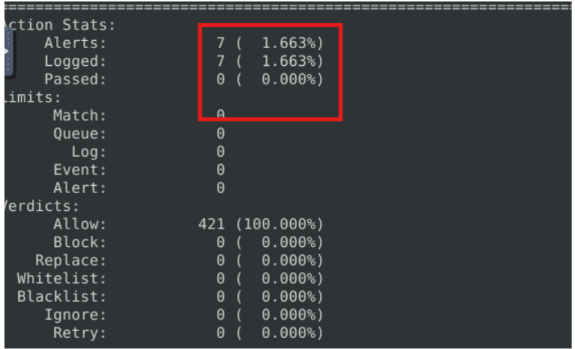

Y la respuesta correcta es “7”.

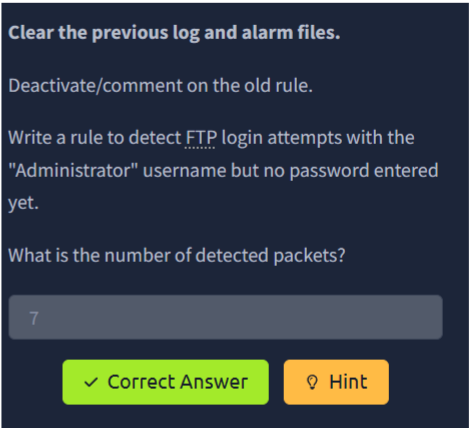

## Conclusión Segundo Reto
En esta segunda parte, el análisis del tráfico FTP se puso en marcha empleando Snort; y, claro, los archivos de registros fueron estudiados a fondo, para identificar y entender las interacciones de este protocolo. ¡Vaya! Así se ha logrado familiarizarse con la detección de eventos FTP y el uso de reglas ad hoc para monitorear el tráfico de forma efectiva.

## Reto 3 - Analizando PNG
En este apartado analizaremos archivos ***PNG(Portable Network 
Graphics)***

## Pregunta 1 Reto 3
En este primera pregunta, investigaremos el software incrustado utilizado.
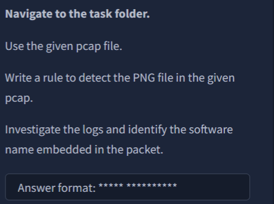

Primero como siempre pondremos la regla necesaria, para el trabajo

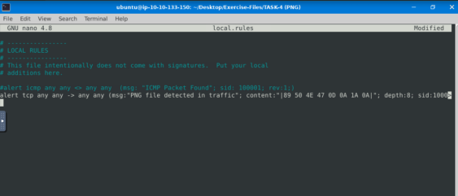

Despues de haber escrito la regla necesaria, usaremos este comando ***“sudo strings ftp-png-gif.pcap”***, para extraer de forma legible información que pueda estar dentro del
archivo pcap.
Si leemos detenidamente, nos damos cuenta de que, se atisba el nombre de un programa ***“Adobe Image Reday”***, deducimos asi, que este es el programa que se uso.

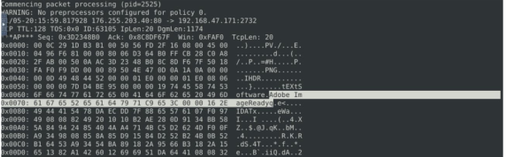

Vamos a la pregunta y vemos, que efectivamente ese era la respuesta que buscábamos.

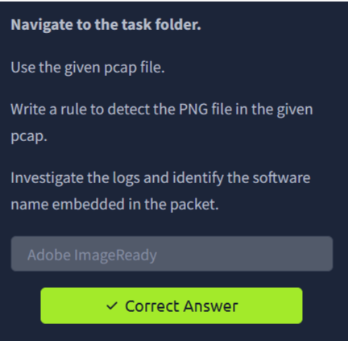

## Pregunta 2 Reto 3
En esta pregunta, nos pide escribamos una nueva regla para investigar los logs en busca del forma embebido de la imagen dentro del paquete.

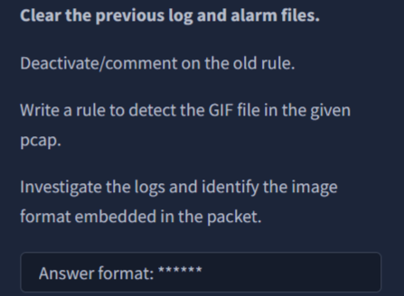

Escribiremos las reglas necesarias para realizar la tarea que nos pide

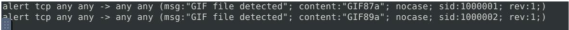

Usaremos el mismo comando que usamos en la pregunta anterior junto al archivo log.

Nos damos cuenta de que el formato es ***“GIF89a”***.

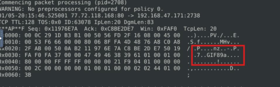

Una vez sepamos la respuesta, iremos a la pregunta del reto y confirmaremos que es la respuesta correcta.

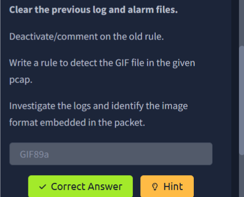

## Conclusión Reto 3
El análisis permitió identificar con claridad la transferencia del archivo PNG dentro del tráfico capturado y verificar que las reglas configuradas detectan este tipo de contenido. 
Esto contribuye a comprender mejor el comportamiento del archivo en la red y a validar la eficacia del sistema de monitoreo.

## Reto 4 - Analizando archivos Torrent

En este reto trabajaremos con archivos torrents.

## Pregunta 1 Reto 4
En esta pregunta, se nos pide que averigüemos, mediante una regla de paquetes detectados.